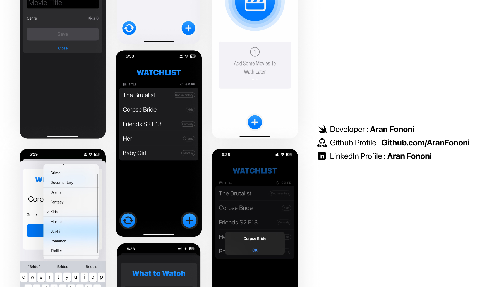

# Watchlist 🎬📌  

### A Minimal Movie Watchlist App Built with SwiftUI & SwiftData  

This is my project from **Chapter 9 of the SwiftUI MasterClass**, and we learned and explored **component-based design, symbol effects, haptic feedback, and accessibility** to make the app more polished.  

## 📌 Project Overview  
This app lets you **save movies to a watchlist, organize them by genre, and pick a random one when you can’t decide!** Built with **SwiftUI** and powered by **SwiftData** for seamless data handling.  

## 🚀 What I Focused On  
- **SwiftData:** Used Apple's latest persistence framework for smooth data management.  
- **Component-Based Design:** Broke down UI into reusable SwiftUI components.  
- **Symbol Effects & Haptic Feedback:** Added subtle interactions for a better experience.  
- **Accessibility:** Made the app more user-friendly with VoiceOver and sensory feedback.  

## 🔥 Features  
✅ Add movies with a title and genre  
✅ Swipe to delete movies from the watchlist  
✅ Pick a **random movie** when you can’t decide  
✅ Simple and clean **SwiftUI** interface  
✅ Uses **SwiftData** for local storage  

---

## 📸 Screenshot  
  

---

## 🛠️ How to Use  
1. Clone this repository.  
2. Open the project in **Xcode (iOS 17+ recommended).**  
3. Run the app and start building your watchlist!  

---

## 📬 Contact  
For any questions or collaborations, feel free to reach out:  
- **Email**: [aranfononi@gmail.com](mailto:aranfononi@gmail.com)  
